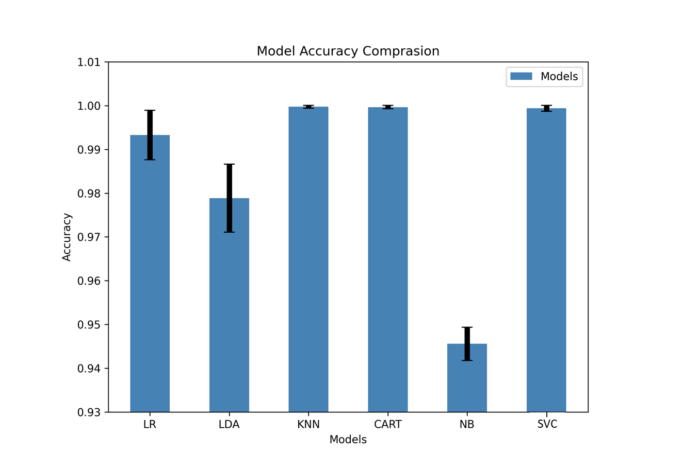

# Code related to training the ML algorithms used for Anomaly Detection System
## Contents
### Files
**AlgorithComparisson.ipynb**
Jupyter Notebook used for comparing the perfomrance of different classifiers by applying K-Fold crossvalidation.
The algorithms compared are as follows:
* Logistic Regression (LR)
* Linear Discriminant Analysis (CART)
* K-Nearest Neighbors (KNN)
* Decision Tree Classifier
* Gaussian Naive Bayes(NB)
* Support Vector Clustering (SVC)

The Dataset used for this code can be found as **LabeledDATANEW.csv** 
The output for the mean accuracy and std-deviation of the accuracy for the K-Fold cross-validation is as follows.

**Training.ipynb**
Jupyter Notebook used for training the ML algorithms and finding the normal traffic labels:
* Obtains data from elasticsearch (Needs to be previously configured and data needs to exist inside an index)
* Saves data as CSV
* Scales data and saves model for later use (you need to manually move this file into the **python** folder of the **Apache Spark** installation)
* Finds optimal value of K for K-Means by sillhouette score
* Trains K-Means on optimal value.
* Joins dataset with clusters output
* Finds optimal value of K for KNN
* Trains KNN with optimal value
* Saves KNN model as a file (you need to manually move this file into the **python** folder of the **Apache Spark** installation)
* Finds the normal traffic labels (You need to provide the normal traffic data from your experiments - DO NOT USE THE TRAINING OR TESTING DATA as it has streams of anomalous traffic included)

This Notebook is a requisite for the Anomaly Detection as it outputs the required models used by the system.

**TrainingCSV.ipynb**
Same as above, but this notebook does not connect to elasticsearch (useful for quick training the models when there is original data in CSV)

**sFLOW-Feat.csv**
30+ days of collected and processed unlabeled dataset with 5 features -> **SumOfFLows, SumOfBytes, SumOfPackets, UniqDstPorts, UniqDstIps**. Used for training the models in **TrainingCSV.ipynb**

**LabeledDATANEW.csv**
Dataset used for comparing the different classifiers in **AlgorithComparisson.ipynb**

### Folders
**figures**
Images used in this section.
