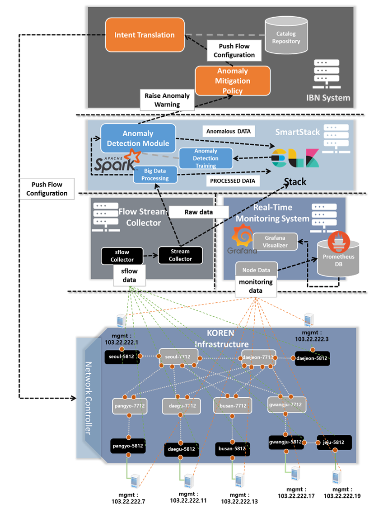

# ML-based-Anomaly-Detection
Anomaly detection system using ML algorithms for clustering unlabeled traffic data, and apply classification based on the clusters. The implementation follows a Data Stream approach where open source utilities like Apache Kafka, Apache Spark and Elasticsearch are utilized. 

The proposed system aims to provide a real-time data stream operation and big data processing framework to achieve immediate and resilient network anomaly detection. By also providing mitigation actions from high level entities like the **IBN tool** which is able to manage the underlying network by means of API flow insertion rules. The status of the system can be observed thanks to a **real-time monitoring** implementation that collects information from hosts and switches.

The overall system is composed of the use of s**Flow configuration** on data plane switches that periodically send traffic data to a data streams pipeline connected to and **sFlow Collector** and **Apache Kafka**. This high volume of data is provisioned to **Apache Spark** for real-time big data processing and anomaly detection. Also, the RAW, processed and Anomalous data are sent to an ELK (Elasticsearch, Logstash, Kibana) stack for historical records. 

Unsupervised learning techniques (**K-Means**) and supervised learning classifier (**KNN**) are used for the anomaly detection.
**Prometheus** and **Grafana** are used for the real time monitoring system that receives the data from the hosts and switches inside the network.
The **I**BN tool** receives the mitigation actions from the Anomaly Detection system and applies the flow rules for deletion of anomalous traffic on the basis of vlanIDs
The whole system aims to guarantee the operation of the anomaly detection mechanism when the volume of data exponentially increases due to flood network attacks.

## Deployment of the system

The system has been deployed in 4 server machines, but it can be deployed in a single machine if the computing resources are sufficient. Be mindful that if deploying in a single machine the use of deployment environments (such as anaconda) are adviced as there are specific version requirements dependent on the version of python that is used.

Hardware                                                                                                              | Software       | Libraries
----------------------------------------------------------------------------------------------------------------------| -------------  | -------------
**Server 1 - SmartStack**   Ubuntu 18.04.5 with 250 GB of RAM and  64 logical CPU cores, 4 Tera drive               | elasticsearch-7.15.0   logstash-7.15.0   kibana-7.15.0   spark-2.3.0-hadoop2.7   Java 8   | python 3.6 pyarrow 0.15   scikit-learn 0.23.0   joblib 1.1.0   pandas 1.1.5   pyspark 3.2.0
**Server 2 - Flow Stream Collector**   Ubuntu 18.04.5 with 64 GB of RAM and  40 logical CPU cores, 2 Tera drive     | goflow2 v1.0.4 kafka_2.12-2.8.1 | python 3.8.8
**Server 3 - Monitoring System**   Ubuntu 18.04.5 with 64 GB of RAM and  40 logical CPU cores, 1 Tera drive         | 
**Server 4 - IBN Tool**   Ubuntu 18.04.5 with 32 GB of RAM and  16 logical CPU cores, 1 Tera drive                  | Mariadb 10.3   Apache2 2.2.41   phpmyadmin 5.0.0-1    | Python 3.8.5